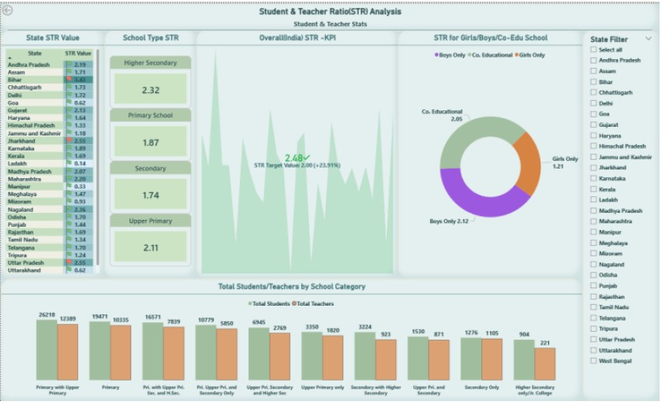

# Power-BI-Mini-Project
Mini Project on Education System Analysis in India (1840–2019)

# 📊 Education System Analysis in India (1840–2019)
## 📌 Project Overview
This project analyzes the Indian school education system from 1840 to 2019, focusing on school infrastructure, student enrollment, and teacher availability.
The analysis covers multiple dimensions such as school type, school category, grade levels, management type, and student–teacher distribution.
The dataset was initially cleaned and enriched using Microsoft Excel, followed by data modeling, transformation, and interactive dashboard creation in Power BI to identify long-term education trends across India.
## 🎯 Project Objectives
- Analyze the growth of schools in India since 1840 based on:
  - School type and category
  - Grade levels offered
  - Management type (Government / Private / Aided)
- Study student enrollment patterns across:
  - School types and categories
  - Grade levels
  - Girls-only, Boys-only, and Co-education schools
- Evaluate Student–Teacher Ratio (STR) at:
  - National level
  - State level
  - Against defined target benchmarks
## 📂 Data Source
- Source: Indian Data Portal (IDP)
- Dataset: Basic Details of Schools
- Domain: Education
## 🛠️ Data Processing
- ### Data Cleaning & Imputation (Excel)
   -  Updated missing PIN codes with 0
  - Replaced blank values in Affiliation Board for Secondary Education and Affiliation Board for Higher Secondary Education with “Others”
  - Removed irrelevant code-based columns not required for analysis
  - Renamed enrollment-related columns for better readability
- ### Data Cleaning & Transformation (Power BI – Power Query)
  - Standardized data types and renamed columns
  - Added Date format to Year of Establishment by prefixing 01/01
  - Created derived and analytical columns:
    - Number of Primary Students (Total Students − Non-Primary Students)
    - School Type (Derived) based on highest class offered
      1. Class To = 4 or 5 → Primary School
      2. Class To = 6, 7, 8 → Upper Primary
      3. Class To = 9, 10 → Secondary
      4. Class To = 11, 12 → Higher Secondary
  - Unpivoted class-wise student count columns to create
    - Grade
    - Student Count
## 🧾 Dataset Description (Key Fields)
The dataset contains comprehensive school-level information including:
| Attribute Name | Data Type | Description |
|----------|----------|----------|
|State	|Text	|Name of the state where the school is located	|
|District Name	|Text	|Administrative district in which the school operates	|
|Sub-District	|Text	|Sub-district / block / taluk under the district	|
|Cluster Name	|Text	|Educational cluster grouping of schools	|
|Village Name	|Text	|Name of the village or locality of the school	|
|UDISE Village Code	|Whole Number	|Unique UDISE code identifying the village	|
|Pincode_upd	|Whole Number	|Postal PIN code of the school location	|
|School Name	|Text	|Official name of the school	|
|School Code	|Whole Number	|Unique UDISE school identification code	|
|School Category	|Text	|Category of school (Primary, Upper Primary, Secondary, Higher Secondary)	|
|School Type	|Text	|Type of school based on structure or curriculum	|
|Management	|Text	|Managing authority (Government, Private, Aided, etc.)	|
|Year of Establishment	|Date	|Year in which the school was established	|
|Longitude	|Decimal Number	|Geographical longitude coordinate of the school	|
|Latitude	|Decimal Number	|Geographical latitude coordinate of the school	|
|Status	|Text	|Operational status of the school (Active/Closed)	|
|Location Type	|Text	|School location classification (Rural/Urban)	|
|Class From	|Whole Number	|Lowest class/grade offered by the school	|
|Class To	|Whole Number	|Highest class/grade offered by the school	|
|Affiliation Board for Secondary Education_upd	|Text	|Board affiliation for secondary education (e.g., State Board, CBSE)	|
|Affiliation Board for Higher Secondary Education_upd	|Text	|Board affiliation for higher secondary education	|
|Number of Pre Primary Rooms	|Whole Number	|Count of classrooms allocated for pre-primary classes	|
|Number of Class Rooms	|Whole Number|Total number of regular classrooms available	|
|Number of Other Rooms	|Whole Number	|Count of non-classroom rooms (office, library, labs, etc.)	|
|Total Teachers	|Whole Number	|Total number of teachers employed in the school	|
|Total Pre Primary Students	|Whole Number	|Total student enrollment in pre-primary classes	|
|Number of Students in Class I	|Whole Number	|Enrollment count for Class I	|
|Number of Students in Class II	|Whole Number	|Enrollment count for Class II	|
|Number of Students in Class III	|Whole Number	|Enrollment count for Class III	|
|Number of Students in Class IV	|Whole Number	|Enrollment count for Class IV	|
|Number of Students in Class V	|Whole Number	|Enrollment count for Class V	|
|Number of Students in Class VI	|Whole Number	|Enrollment count for Class VI	|
|Number of Students in Class VII	|Whole Number	|Enrollment count for Class VII	|
|Number of Students in Class VIII	|Whole Number	|Enrollment count for Class VIII	|
|Number of Students in Class IX	|Whole Number	|Enrollment count for Class IX	|
|Number of Students in Class X	|Whole Number	|Enrollment count for Class X	|
|Number of Students in Class XI	|Whole Number	|Enrollment count for Class XI	|
|Number of Students in Class XII	|Whole Number	|Enrollment count for Class XII	|
|Number of Non Primary Students	|Whole Number	|Total students excluding pre-primary classes|
|Number of Total Students|Whole Number| Total student enrollment across all classes	|

## 📊 Data Presentation
Three interactive Power BI dashboards were created to present insights effectively:
### Education Overview Dashboard

### Student Enrollment Analysis Dashboard

### Teacher & Student–Teacher Ratio Analysis Dashboard

## 📈 Analysis & Visualization Techniques
The dashboards include:
- KPI Cards
- Shape Maps (India & State-level)
- Stacked & Clustered Column Charts
- Matrix with Year of Establishment (Drill-down enabled)
- Donut & Pie Charts
- Tree Maps
- Clustered Bar Charts
- Interactive slicers for:
  - State
  - School Category
  - School Type
## 🌟 Highlights
- Clear visualization of total schools in India since 1840
- State-wise and school-type-wise distribution of schools
- Grade-level student enrollment trends
- Comparative view of Girls, Boys, and Co-education schools
- Student–Teacher Ratio (STR) analysis across states and school categories
## 🔍 Key Insights
- STR Benchmark:
  - A value of 30 was considered a healthy and standard Student–Teacher Ratio for analysis
  - However, the dataset shows STR values below 3 across all states, indicating data anomalies or potential reporting issues
- This highlights the need for policy review and data validation
  - Teacher distribution shows nearly 50% allocation across all school categories, which may not align with actual requirements
- Girls-only schools are significantly fewer compared to co-education schools
- Student enrollment is high in Primary and Upper Primary levels, but shows a gradual decline in Secondary and Higher Secondary levels
## 🧠 Tools & Technologies
- Microsoft Excel – Data cleaning & imputation
- Power BI – Data modeling, DAX, visualization
- Power Query – Data transformation
- GitHub – Project documentation & version control

